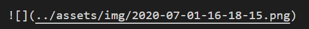
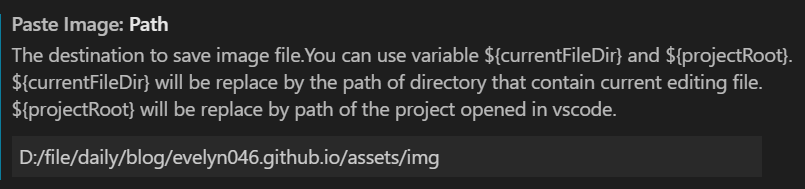

写博客用的是VScode + Markdown，但用markdown插入图片是件非常麻烦的事情。通常有两种方法：
- 把图片上传到图床，然后把链接写到``里
- 把图片保存到本地，使用相对路径添加

无论哪种方法，都必须经过“保存图片” -> “插入”这一步，那么有没有类似微信截图，可以直接复制插入剪切板上的图片的方法呢？
### 使用VScode中的**Paste Image**插件

在 *Extension* 中搜索 **Paste Image** 下载安装即可

 
 

截图后按下`ctrl + alt + v`即可快速插入图片。

图片默认保存在当前文档所在的目录，可以对目录进行修改。

在 *File* -> *Preferences* -> *Settings*中搜索“Paste Image”即可修改保存路径

> 我将路径修改为了当前目录下的assets文件夹中的img文件夹，如果输入的文件夹不存在，则会自动创建同名文件夹。

此外，还可以修改保存的文件名，默认为**年-月-日-时-分-秒**
